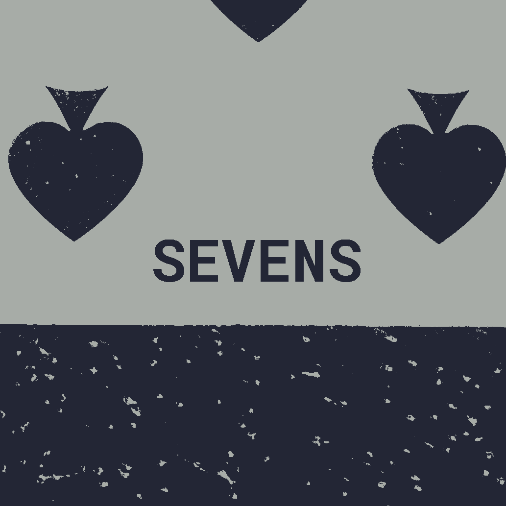

# SEVENS

**Sevens is a card game, played with a standard deck of 52 cards**.

## Objective

In sevens, each player attempts to make bundles that sum to **seven**.
You may not play off already-made bundles.

The winner is the player with the most bundles.

## Setup

Each player starts the game with **seven** cards.

The remaining cards are placed in a pile, forming the _draw pile_.

Determine who goes first.

## Sequence

At the beginning of each player's turn, they draw until their hand is back to **seven**.

Then, the player will _either_:

1. Make as many bundles of **seven** as they can, or
2. Discard as many cards as they want

When the final card from the _draw pile_ is drawn and the current player finishes their turn, the game is over and is then scored.

### 1. Making bundles of **seven**

Bundles are created by adding and subtracting cards.  Examples:

> John plays valid bundle of 9 and 2.
>
> `9 - 2 = 7`
>
>
> Sarah plays a King (13), a 5, a 3, and a 2
>
> `13 - 5 - 3 + 2 = 7`

### 2. Discarding Cards

Instead of playing bundles, a player can spend their turn discarding as many or as little cards as they'd like.

However, be warned:
Discarded cards are **permanently** removed from the game.
Any _discard pile_ that is formed **will not be shuffled back into the draw pile**.

## Scoring

The winner is the player with the most bundles.

In the case of a tie, the player with the _least_ amount of cards remaining in their hand is the winner.

If there is _still a tie_, the player with the most amount of (actual) sevens played is the winner.

## Card Values

| card  | value |
|:------|:------|
| Ace   | 1     |
| 2     | 2     |
| 3     | 3     |
| 4     | 4     |
| 5     | 5     |
| 6     | 6     |
| 7     | 7     |
| 8     | 8     |
| 9     | 9     |
| 10    | 10    |
| Jack  | 11    |
| Queen | 12    |
| King  | 13    |
